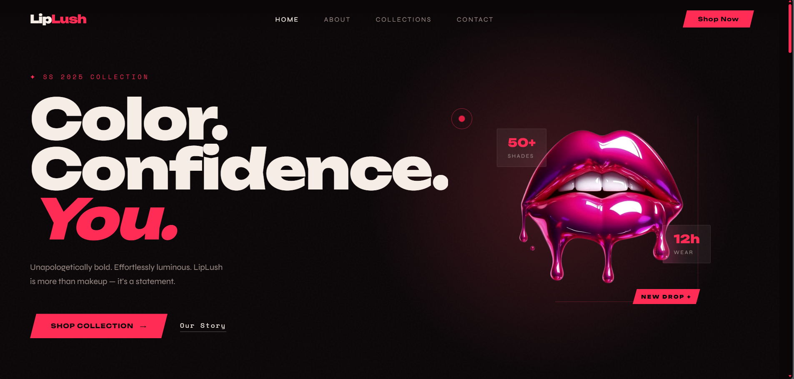
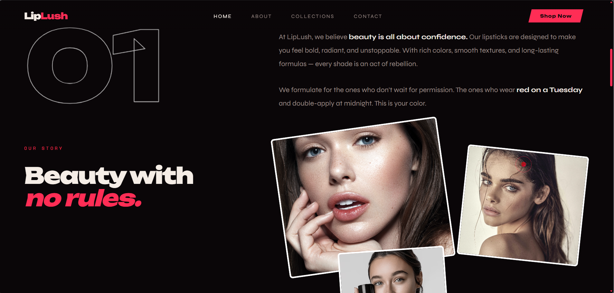
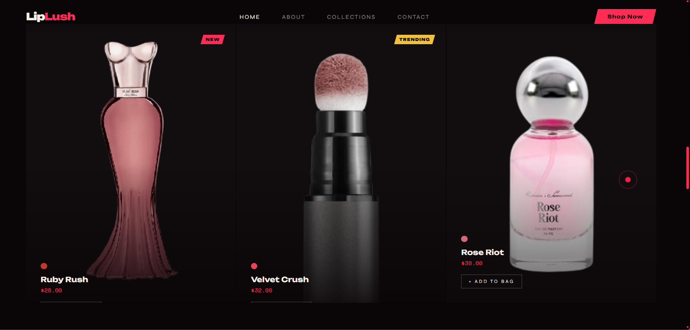
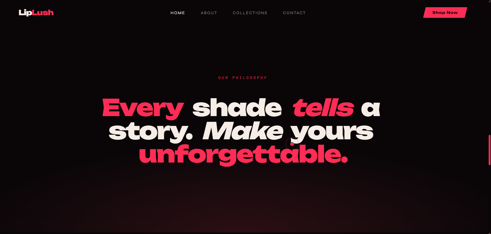
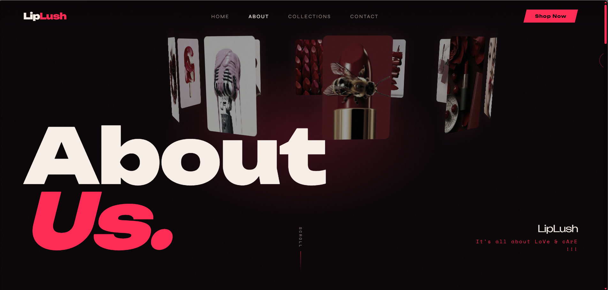
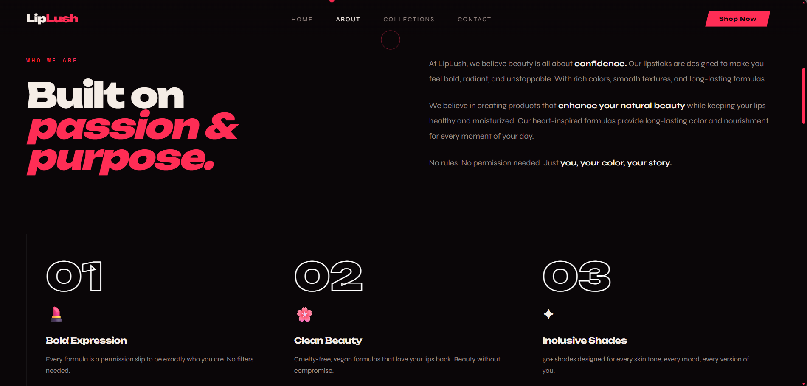
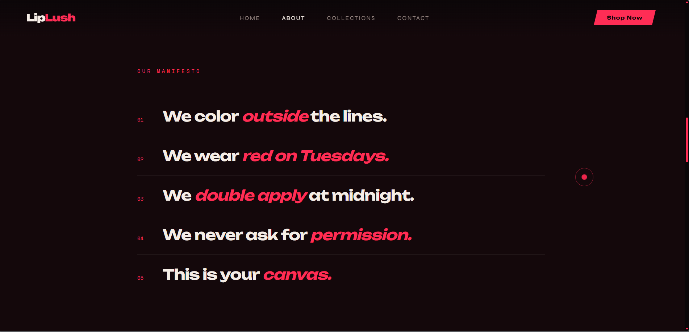
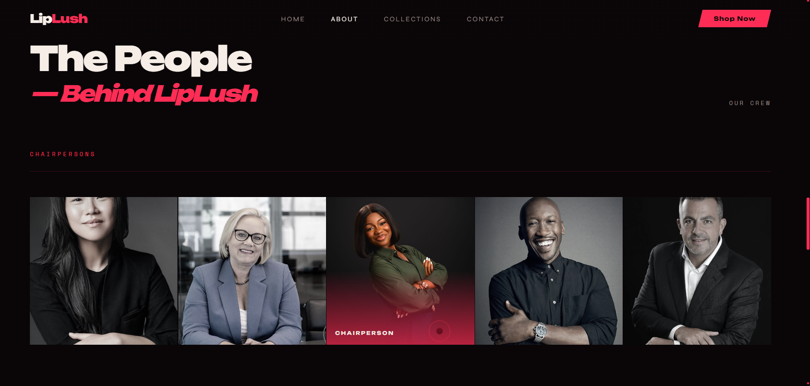

# 💄 LipLush

## A Modern, Interactive Beauty Brand Website

**LipLush** is a **mobile-responsive beauty brand website** designed for a **Gen-Z audience**.  
It showcases products, brand values, and team members through an immersive experience powered by **bold animations, vibrant visuals, and interactive UI elements**.

The platform allows users to:

- Explore featured products in a **3D rotating carousel**
- Learn about the brand’s **values and manifesto**
- Meet the **team through interactive cards**
- Experience **smooth animations and engaging UI**

The goal of the project is to create a **fun, visually striking, and interactive brand experience** for young users.

---

# 🚨 Problem Statement

Many beauty brand websites today:

- Lack **interactive and engaging UI**
- Display products in **static layouts**
- Fail to connect with **Gen-Z aesthetics**

**LipLush solves this by building a visually bold, animation-driven website** designed to attract and engage younger audiences.

---

# ✨ Features

- 🎡 **3D Rotating Product Carousel**
- 🖱 **Custom Neon Cursor & Hover Effects**
- 📜 **Smooth Scroll Animations**
- 💬 **Brand Manifesto & Values Section**
- 👥 **Interactive Team Cards**
- 📢 **Ticker / Marquee Animations**
- 📱 **Fully Responsive Layout**
- 🎨 **Bold Typography & Neon UI Style**

---

# 🛠 Tech Stack

| Technology | Purpose |
|-----------|--------|
| **HTML5** | Website structure |
| **CSS3** | Styling, gradients, animations |
| **JavaScript (Vanilla)** | Interactive features |
| **Responsive Design** | Mobile & desktop support |
| **No Frameworks** | Lightweight and simple |

---

# 📸 Screenshots

## 🏠 Homepage

| Hero Section | Main Section |
|--------------|--------------|
|  |  |

| Product Section | Feature Section |
|-----------------|----------------|
|  |  |

---

## 📖 About Page

| AboutUS   | Purpose   |
|-----------|-----------|
|  |  |

| Manifesto | People    |
|-----------|-----------|
|  |  |

---

# 🎥 Demo

A short demo video of the website:

```
demo.mp4
```

You can view it directly from the repository.

---

# 📂 Project Structure

```
LIPSTICK/
│
├── index.html
├── about.html
├── style.css
├── demo.mp4
│
├── about/
│   └── images for about page
│
├── assets/
│   └── UI assets and icons
│
├── banner/
│   └── banner graphics
│
├── models/
│   └── 3D product models
│
├── products/
│   └── product images
│
├── team/
│   └── team member images
│
├── screenshots/
│   └── images used in README
```

---

# ⚙️ How the Website Works

## 1️⃣ Interactive Product Carousel

Users can rotate through products dynamically.

```javascript
const carousel = document.querySelector('.carousel');

carousel.addEventListener('mousemove', (e) => {
  carousel.style.transform = `rotateY(${e.offsetX / 2}deg)`;
});
```

This creates a **3D rotation effect** based on cursor movement.

---

## 2️⃣ Custom Neon Cursor

The cursor dynamically follows the mouse to create a **neon interaction effect**.

```javascript
const cursor = document.querySelector('.cursor');

document.addEventListener('mousemove', (e) => {
  cursor.style.left = e.clientX + 'px';
  cursor.style.top = e.clientY + 'px';
});
```

---

## 3️⃣ Scroll Reveal Animations

Sections smoothly appear when the user scrolls.

```javascript
const sections = document.querySelectorAll('.reveal');

window.addEventListener('scroll', () => {
  sections.forEach(sec => {
    const top = sec.getBoundingClientRect().top;

    if (top < window.innerHeight - 100) {
      sec.classList.add('active');
    }
  });
});
```

This improves **visual storytelling and engagement**.

---

# 🧠 Skills Demonstrated

- Frontend Web Development
- Interactive UI Design
- Responsive Web Design
- Animation & Motion UI
- JavaScript DOM Manipulation
- Brand-focused visual storytelling

---

# 🌍 Real World Applications

- 💄 Interactive **beauty brand websites**
- 🎨 **Modern product showcase platforms**
- 📱 **Mobile-first marketing websites**
- 🛍 Can be expanded into a **full e-commerce store**

---

# 💡 Future Improvements

- Product filtering & sorting
- Blog / marketing content section
- GSAP animation integration
- CMS for dynamic product updates
- Dark mode toggle
- Accessibility improvements
